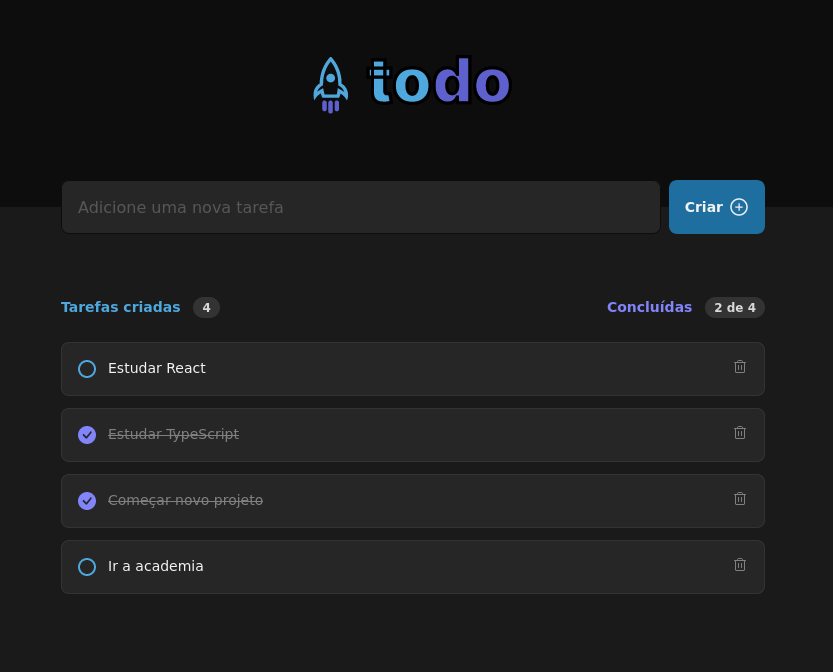
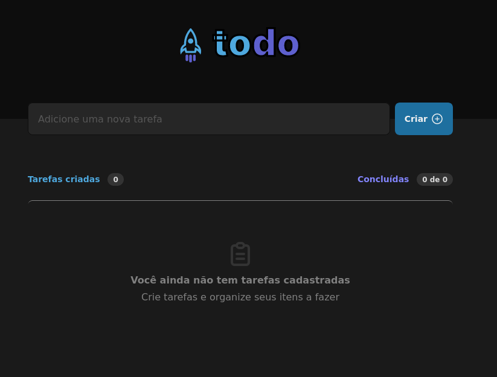

 
  

## About

A aplicação consiste em um 'To Do list'. Foi proposto como desafio ao fim do módulo 1 da trilha de ReactJs do ignite. 

## Screenshots

 
  

 
 

 
  

## Features

- Adicionar uma nova tarefa
- Marcar e desmarcar uma tarefa como concluída
- Remover uma tarefa da listagem
- Mostrar o progresso de conclusão das tarefas

## Technologies

The following tools were used in this project:

- [React](https://pt-br.reactjs.org/)
- [TypeScript](https://www.typescriptlang.org/)
